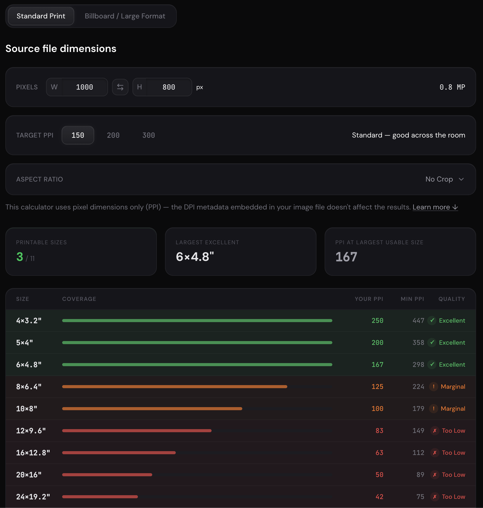

# Pixel to Print Calculator

A tool for photographers, designers and artists to determine which print sizes their digital images can support at a given quality level.



Enter your image's pixel dimensions and choose a target PPI — the calculator evaluates 15 common print sizes (4×6" through 36×48") and rates each one as **Excellent**, **Good**, **Marginal**, or **Too Low** based on the effective resolution your file achieves.

It also shows the perceptual minimum PPI for each size (based on typical viewing distance), so you can see when a print will look sharp in practice even if it falls below your technical target.

> [!NOTE]
> Quality ratings are based on perceptual heuristics (viewing distance, visual acuity estimates) and are intended as a practical guide, not a definitive standard. Calculations may be inaccurate. Results may vary depending on the printer, paper, viewing conditions, and individual perception. Use at your own risk.

## Features

- Instant quality ratings across 15 standard print sizes
- Considers both landscape and portrait orientations
- Perceptual min-PPI threshold per size (1-arcminute visual acuity at 1.5× diagonal)
- Summary cards: printable count, largest excellent size, max PPI at that size
- PPI vs DPI explainer section

## Stack

- [React](https://react.dev/) — UI
- [Vite](https://vitejs.dev/) — build tool
- [Tailwind CSS v4](https://tailwindcss.com/) — styling

## Getting Started

> Requires [pnpm](https://pnpm.io). Install it with `npm i -g pnpm` if needed.

```bash
pnpm install
pnpm dev
```

The app runs at `http://localhost:3000`.

## Build

```bash
pnpm build
pnpm preview
```

## Contributing

Bug reports and pull requests are welcome. For major changes, open an issue first to discuss what you'd like to change.

## License

[MIT](LICENSE)
