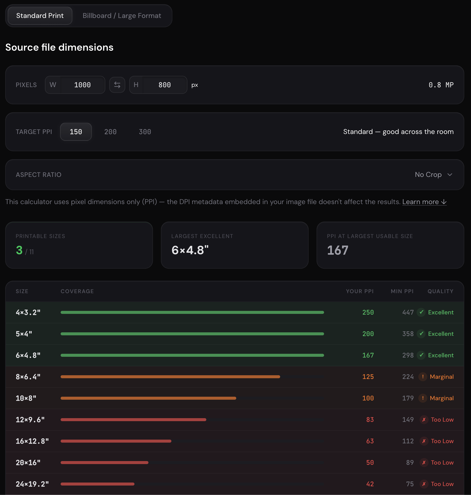

# Pixel to Print Calculator

A tool for photographers, designers and artists to determine which print sizes their digital images can support at a given quality level.



Enter your image's pixel dimensions and choose a target PPI — the calculator evaluates 15 common print sizes (4×6" through 36×48") and rates each one as **Excellent**, **Good**, **Marginal**, or **Too Low** based on the effective resolution your file achieves.

It also shows the perceptual minimum PPI for each size (based on typical viewing distance), so you can see when a print will look sharp in practice even if it falls below your technical target.

The calculator has three modes: **Standard Print**, **Billboard / Large Format** (sizes in feet, rated against viewing-distance PPI targets), and **Print → Pixels** — a reverse mode where you enter a target print size (in inches or feet) and DPI to get the minimum pixel dimensions your file needs.

> [!NOTE]
> Quality ratings are based on perceptual heuristics (viewing distance, visual acuity estimates) and are intended as a practical guide, not a definitive standard. Calculations may be inaccurate. Results may vary depending on the printer, paper, viewing conditions, and individual perception. Use at your own risk.

## Features

- Instant quality ratings across 15 standard print sizes
- Considers both landscape and portrait orientations
- Perceptual min-PPI threshold per size (1-arcminute visual acuity at 1.5× diagonal)
- Summary cards: printable count, largest excellent size, max PPI at that size
- Billboard / large-format mode with viewing-distance PPI presets
- Reverse "Print → Pixels" mode: target print size + DPI → required pixel dimensions
- PPI vs DPI explainer section

## Getting Started

This project uses [pnpm](https://pnpm.io). Install it first if you don't have it (`npm i -g pnpm`), then:

```bash
pnpm install
pnpm dev
```

The app runs at `http://localhost:3000`.

## Build

```bash
pnpm build
pnpm preview
```

## Tech Stack

- [React](https://react.dev/)
- [Vite](https://vitejs.dev/)
- [Tailwind CSS v4](https://tailwindcss.com/)
- [pnpm](https://pnpm.io/) (package manager — required)

## Contributing

Bug reports and pull requests are welcome. For major changes, open an issue first to discuss what you'd like to change.

Maintainers: see [DEPLOY.md](DEPLOY.md) for the release and deploy process.

> [!NOTE]
> This project uses [pnpm](https://pnpm.io) for development and maintains a `pnpm-lock.yaml`. If you're contributing, use pnpm to keep the lockfile consistent: `npm i -g pnpm`.

## License

[MIT](LICENSE)
